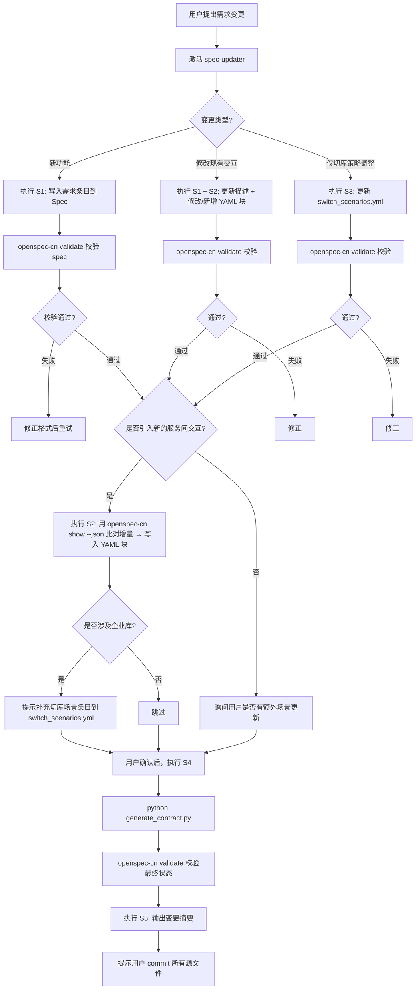

# spec-updater

## 核心职责

解决两个问题：**"改了什么"** 和 **"改完之后怎么办"**。在 OpenSpec-CN 体系下充当自动化的变更追踪器，确保每次需求迭代被准确记录，并联动触发下游契约和任务更新。

## `openspec-cn` 集成原则

**核心思路：用 `openspec-cn` 命令替代手工编辑，让 AI 直接通过 CLI 操作规范文件，从而保证格式、一致性，并自动触发下游更新。**

| 环节 | 传统方式 | 使用 `openspec-cn` 后 |
|------|---------|----------------------|
| 需求记录 | AI 手写 Markdown | 按规范格式编辑 → `openspec-cn validate` 校验，格式零风险 |
| 交互提取 | AI 从对话中推测 | `openspec-cn show --json --deltas-only` 导出增量 → AI 比对 |
| 一致性校验 | 人工复查 | `openspec-cn validate` 自动执行（每次写操作后必做） |
| 场景清单 | 维护独立 YAML | 嵌入 Spec 的 `x-` 扩展，未来可自动导出 |
| 契约生成 | 脚本解析 Markdown | 脚本读取 `openspec-cn show --json` 输出的标准格式（未来方向） |
| 变更日志 | AI 凭"记忆"总结 | `openspec-cn show --json --deltas-only` + git diff 组合生成 |

> AI 的角色从"规范文档写手"转变为**命令编排者 + 决策确认者**。

## 依赖

| 依赖 | 说明 |
|------|------|
| `openspec-cn` CLI | 用于校验和查询规范（`validate`、`show --json`、`list`） |
| `contract-maintainer` Skill | 用于从更新后的源文件生成契约（`generate_contract.py`） |

## 触发条件

用户消息包含以下关键词之一时**必须触发**：
- "更新规范" / "修改 Spec" / "spec变更"
- "新增需求" / "新增功能" / "需求迭代"
- "openspec 同步" / "同步规范"
- "记录需求" / "需求条目"

## 核心能力

| ID | 能力 | 触发词 | 描述 |
|----|------|--------|------|
| S1 | 需求记录 | "记录需求" | 将需求变更按 OpenSpec-CN 格式写入 Spec 文件，然后 `validate` 校验 |
| S2 | 交互提取 | "提取交互" | 用 `openspec-cn show --json --deltas-only` 导出增量 → AI 比对 → 追加 YAML 块 |
| S3 | 场景清单刷新 | "更新切库场景" | 若变更涉及企业库操作，在 `switch_scenarios.yml` 中记录切库规则 |
| S4 | 契约联动 | "同步契约" | 调用 `contract-maintainer` 生成脚本，再执行 `validate` 校验输出 |
| S5 | 变更摘要 | "变更总结" | `openspec-cn show --json --deltas-only` + `contracts/interop_contract.yml` diff → 生成摘要 |

## 工作流



## 源文件结构

```
openspec/changes/<change-name>/
├── specs/                          # Spec 源文件（S1/S2 修改此处）
│   ├── live-core/spec.md          # 直播核心 CRUD
│   ├── mq-event/spec.md           # MQ 事件链路
│   ├── progress/spec.md           # 进度计算
│   ├── admin-upload-replay-bind/  # 回放上传/解绑
│   ├── cleanup/spec.md            # 清理与优化
│   ├── operation-log/spec.md      # 操作日志
│   └── notification/spec.md       # 消息通知
├── specs/switch_scenarios.yml     # 切库场景清单（S3 修改此处，不存在时新建）
├── contracts/
│   ├── contract_manual.yml        # 手动条目源文件（S4 读取）
│   └── interop_contract.yml       # 契约文件（S4 自动生成，只读）
├── design.md                       # 技术方案设计
└── tasks.md                        # 任务清单
```

## 内嵌指令模板

### S1: 需求记录（openspec-cn 驱动）

执行步骤：
1. 根据用户描述，将需求拆解为符合 OpenSpec-CN 的原子条目。
2. 定位到 `openspec/changes/<change-name>/specs/<service>/spec.md`
3. 写入 `## 新增需求` / `## 修改需求` 章节（OpenSpec-CN 格式要求）：
   - 每个需求必须包含 `SHALL`/`MUST`/`必须`/`禁止` 关键词
   - 每个需求必须有 `#### 场景:` 块
4. 修改后立即运行 `openspec-cn validate <change-name>` 校验。
5. 如果校验失败，根据错误提示修正源文件，直到通过。
6. 展示生成的修改摘要让我确认。

Verify by: `openspec-cn validate` 返回零错误；摘要包含条目 ID、标题、影响范围。

用户描述：
{{PASTE_REQUIREMENT_HERE}}

### S2: 交互提取

执行步骤：
1. 运行 `openspec-cn show <change-name> --json --deltas-only` 导出当前变更的增量需求。
2. 将增量与本次新交互需求对比，识别新增/修改的 RPC/MQ 调用。
3. 对于新增交互，按以下 YAML 块模板写入对应的 Spec 文件：

```yaml
rpc:
  - name: MethodName
    description: 交互说明
    caller: caller-service
    callee: callee-service
    protocol: SOFA RPC
    request:
      field1: type
      field2: type
    response:
      result: type
```

```yaml
mq:
  - topic: topic_name
    tag: tag_name
    producer: producer-service
    consumer: consumer-service
    description: 消息说明
    message_model: CONCURRENT / ORDERLY
    schema:
      field1: type
      field2: type
    error_handling: 异常处理说明
```

4. 修改后运行 `openspec-cn validate <change-name>` 校验通过。
5. 做一次 `openspec-cn show --json` 检查增量是否被正确解析。

Verify by: YAML 块写入后 `openspec-cn validate` 通过；交互双方、字段、协议与实际一致。

来源：
{{PASTE_SOURCE_HERE}}

### S3: 场景清单刷新（切库场景记录）

本次变更可能影响企业库切库逻辑。手动补充或更新 `switch_scenarios.yml` 中的条目。

切库场景模板：
```yaml
- id: SW-XX
  service: service-name
  description: 场景说明
  trigger: 触发条件（含 MQ Topic 或 REST 路径）
  source_of_enterprise_id: enterpriseId 来源描述
  error_handling: 切库失败处理
```

涉及交互：
{{PASTE_YAML_BLOCKS}}

Verify by: 新场景条目包含所有必填字段（`id`、`service`、`trigger`、`source_of_enterprise_id`、`error_handling`）；`openspec-cn validate` 通过。

### S4: 契约联动

Spec 和场景清单已更新。现在调用 contract-maintainer 的生成脚本同步契约：

```powershell
pip install pyyaml  # 确保依赖安装
python .opencode\skills\contract-maintainer\scripts\generate_contract.py `
  --spec-dir openspec/changes/<change-name>/specs/ `
  --switch openspec/changes/<change-name>/specs/switch_scenarios.yml `
  --manual openspec/changes/<change-name>/contracts/contract_manual.yml `
  --output openspec/changes/<change-name>/contracts/interop_contract.yml
```

生成后运行验证和一致性检查：
```powershell
openspec-cn validate <change-name>
```

注意：不要自行模拟生成逻辑或编造输出。直接运行脚本，根据脚本的实际 stdout 决定下一步。

Verify by: `openspec-cn validate` 通过；`interop_contract.yml` 包含预期的新增条目。

### S5: 变更摘要

执行步骤：
1. 运行 `openspec-cn show <change-name> --json --deltas-only` 获取本次迭代修改了哪些规范条目。
2. 对比 `contracts/interop_contract.yml` 的 git diff（新增/修改/删除的行数）。
3. 对比 `specs/switch_scenarios.yml` 的 git diff。
4. 生成汇总：

**修改的 Spec 文件**：（列出增量条目 ID 和标题）
**新增/修改的交互**：（根据 `--json` 输出的 `interactions`）
**场景清单变更**：（`switch_scenarios.yml` diff）
**契约状态**：（`interop_contract.yml` 条目数变化）
**待人工复核**：（如：与澄清记录矛盾等）

## 与 contract-maintainer 的协作

| 层面 | spec-updater | contract-maintainer |
|------|-------------|-------------------|
| 职责 | **写源文件**（Spec + 场景清单） | **读源文件，生成目标文件** |
| 产物 | specs/*.md, switch_scenarios.yml | interop_contract.yml |
| 触发 | 用户提需求时 | spec-updater 完成 S1-S3 后显式询问用户 |
| 关系 | 上游 | 下游 |

协作流程：spec-updater S1-S3 → `openspec-cn validate` 校验 → 用户确认 → spec-updater S4（调用 contract-maintainer）→ contract-maintainer 生成 → `openspec-cn validate` 校验 → spec-updater S5 输出摘要。

## 初始化检查

首次激活时自动确认：

1. `openspec-cn` 命令可用 → `openspec-cn --version`
2. 项目存在 `openspec/changes/<活跃变更名>/specs/` 目录
3. `switch_scenarios.yml` 是否存在（不存在时 S3 需新建）
4. `contracts/` 目录是否存在（不存在时 S4 前需新建）
5. 运行 `openspec-cn validate <change-name>` 检查当前状态
6. 若任意项不满足，引导用户完成基础设置

## 已知命令状态

| `openspec-cn` 命令 | 状态 | 在 spec-updater 中的用途 |
|--------------------|------|------------------------|
| `validate <change>` | ✅ 可用 | 每次写操作后校验格式 |
| `show <change> --json --deltas-only` | ✅ 可用 | S2 导出增量、S5 变更摘要 |
| `list --specs` | ✅ 可用 | 初始化检查 |
| `add <service>` | ❌ 暂不支持 | 未来替换手动编辑 |
| `export --format yaml` | ❌ 暂不支持 | 未来作为契约生成输入 |
| `log --since <date>` | ❌ 暂不支持 | 未来辅助 S5 变更摘要 |

暂不支持的命令用 `spec_updater.py` 脚本和人工编辑替代。

## 与 AGENTS.md 的关系

- **权威源顺序**：代码仓库 + TR3/TR4 + 澄清记录（`source/clarification-record.md`）→ specs/ → design.md → tasks.md
- 发现矛盾时不直接覆盖，按 AGENTS.md 流程回写并记录到澄清记录
- 修改前可参考 AGENTS.md 中"关键设计决策"部分确认不冲突
