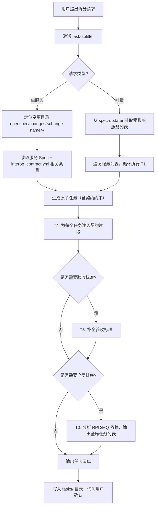

# task-splitter

## 核心职责

将已确认的 OpenSpec 规范和 `interop_contract.yml` 契约转化为**可独立执行、可验证、严格遵循契约约束**的原子开发任务，并按服务依赖关系编排为全局有序的执行计划。

## 依赖

| 依赖 | 说明 |
|------|------|
| `spec-updater` Skill (methodologies/providers/openspec-cn/skills/spec-updater/) | 提供更新后的 Spec 文件路径和本次迭代涉及的服务列表 |
| `contract-maintainer` Skill | 提供最新 `interop_contract.yml`（由 `generate_contract.py` 保证一致性） |
| `openspec/changes/<change-name>/` | 项目规范源文件目录结构 |

## 触发条件

用户消息包含以下关键词之一时**必须触发**：
- "拆分任务" / "生成原子任务" / "任务清单"
- "全局任务排序" / "全局排序" / "整合任务"
- "开发计划" / "实现计划" / "迭代任务"
- "为 [服务名] 拆分" / "为 [服务名] 生成任务"

## 核心能力

| ID | 能力 | 触发词 | 描述 |
|----|------|--------|------|
| T1 | 单服务任务拆分 | "拆分 [服务名] 的任务" | 读取指定服务的 Spec 和契约中相关条目，生成原子任务列表，每个任务绑定契约约束 |
| T2 | 批量服务拆分 | "拆分所有受影响服务" | 对迭代涉及的所有服务依次执行 T1 |
| T3 | 全局任务编排 | "全局排序"、"整合任务" | 分析所有任务间的服务调用依赖（RPC/MQ），输出按"被调用方先实现"原则排序的全局任务清单 |
| T4 | 契约片段注入 | （自动执行） | 拆分时为每个任务自动粘贴关联的契约条目 ID 和关键约束，确保实现不偏离 |
| T5 | 验收标准生成 | "验收标准"、"验收条件" | 基于 Spec 的验收场景和契约的错误处理规则，为每个任务生成 Given-When-Then 验收点 |

## 工作流



## 输出目录结构

```
openspec/changes/<change-name>/
├── tasks/                          # task-splitter 输出（自动创建）
│   ├── <service-name>.md          # 单服务原子任务清单
│   ├── <service-name>.md
│   └── global-plan.md             # 全局排序后的执行计划（T3 输出）
├── specs/                          # spec-updater 维护
├── contracts/                      # contract-maintainer 维护
├── design.md
└── tasks.md                        # （可选）用户入口任务索引
```

## 内嵌指令模板

### T1: 单服务任务拆分

执行步骤：
1. 确认当前变更目录 `openspec/changes/<change-name>/` 存在。
2. 读取 `openspec/changes/<change-name>/specs/<service-name>/` 下的所有 Spec 文件。
3. 读取 `openspec/changes/<change-name>/contracts/interop_contract.yml` 中所有 **调用方或被调用方** 包含 `<service-name>` 的条目。
4. 按以下原则拆分任务：
   - 每个任务只做一件事，可直接映射到 Spec 的特定需求或验收场景。
   - 必须标注依赖提示（如"依赖 T-XXX 的被调用方接口就绪"），但不在本步骤排序。
   - 若任务涉及企业库切库，必须引用 `switch_scenarios.yml` 中的场景 ID。

每个原子任务包含：

```
T-<编号> <任务标题>
- 引用 Spec: [文件名]:[章节/需求ID]
- 契约约束: [interop_contract.yml 条目 ID] [关键约束点]
- 切库场景: [switch_scenarios.yml 场景 ID]（如有）
- 验收标准: [如何验证]
```

5. 写入 `tasks/<service-name>.md`。

Verify by: 每个任务可溯源到唯一 Spec 需求 + 契约条目；无遗漏需求；任务粒度不超过 8h 工时。

拆分对象：
{{PASTE_SERVICE_NAME_HERE}}

### T2: 批量服务拆分

```
需拆分的服务列表：{{SERVICE_LIST}}
输出位置：tasks/*.md（每个服务一个文件）
```

规则：
1. 从用户上下文或 `spec-updater` 获取受影响服务列表。
2. 对每个服务执行 T1。
3. 若列表为空，提示先运行 `spec-updater` 完成需求录入。

### T3: 全局任务编排

执行步骤：
1. 读取 `tasks/` 下所有任务文件。
2. 分析所有任务间的 RPC 和 MQ 依赖关系（参考 `interop_contract.yml`）。
3. 按"被调用方/生产者先实现，调用方/消费者后实现"原则排序。
4. 无依赖的任务归入"并行开发池"。

输出格式：

```
Phase 1: 基础接口与契约实现（被调用方）
  - [服务名] T-XXX 任务描述
Phase 2: 核心逻辑（调用方）
  - [服务名] T-XXX 任务描述
Phase 3: 集成与验证
  - [服务名] T-XXX 任务描述
并行开发池（无依赖）：
  - [服务名] T-XXX 任务描述
```

5. 写入 `tasks/global-plan.md`。

### T4: 契约片段注入（自动执行，不单独触发）

在 T1/T2 的每个任务中，自动追加契约上下文：

```
契约条目: {{ENTRY_ID}}
- 调用方: {{caller}} → 被调用方: {{callee}}
- 协议: {{protocol}}
- 请求字段: {{request_schema}}
- 响应字段: {{response_schema}}
- 错误码: {{errors}}
- 切库场景: {{switch_scenario_id}}
```

### T5: 验收标准生成

为每个原子任务补充可测试的验收标准：

```
验收标准:
- Given: [前提条件] When: [操作] Then: [预期结果]
- 直接引用 Spec 中的验收场景（## 场景: 块）
- 覆盖契约中的错误处理规则
```

## 与 spec-updater 和 contract-maintainer 的协作

| 层面 | spec-updater | contract-maintainer | task-splitter |
|------|-------------|-------------------|--------------|
| 职责 | 写源文件（Spec + 场景清单） | 读源文件，生成契约 | 读源文件+契约，生成任务 |
| 产物 | specs/*.md, switch_scenarios.yml | interop_contract.yml | tasks/*.md, global-plan.md |
| 触发 | 用户提需求 | spec-updater 完成 | spec-updater + contract-maintainer 就绪 |
| 关系 | 最上游 | 中游 | 最下游 |

协作流程：
`spec-updater` (S1-S3) → `openspec-cn validate` → `contract-maintainer` (生成契约) → `openspec-cn validate` → **task-splitter** → 输出任务清单

## 初始化检查

首次激活时自动确认：

1. `openspec/changes/<活跃变更名>/specs/` 目录存在且包含至少一个服务子目录。
2. `openspec/changes/<活跃变更名>/contracts/interop_contract.yml` 文件存在且格式有效。
3. 若 1/2 缺失，提示用户先运行 `spec-updater` 完成需求录入和 `contract-maintainer` 契约生成。
4. 若 `tasks/` 目录不存在，自动创建。

## 与 AGENTS.md 的关系

- 输出目录 `tasks/` 位于 `openspec/changes/<change-name>/` 下，与其他源文件并列。
- 任务拆分时引用 AGENTS.md 中的"关键设计决策"约束，确保任务不偏离已确认的设计。
- 单任务工时遵循 AGENTS.md 规范（4h ≤ 单任务 ≤ 8h）。
